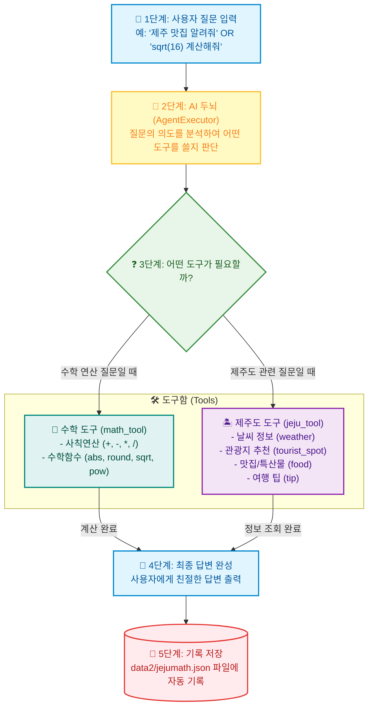

# 🔰 [초보자 가이드] mymathjeju.py 구조 & 작동 원리 (Mermaid 다이어그램)

이 문서는 **LangChain AI 에이전트**로 작동하는 `mymathjeju.py` 프로그램이 **사용자의 질문을 판단하고 도구를 골라 답변하는 전체 과정**을 초보자도 한눈에 이해할 수 있도록 작성한 설명서입니다.

---

## 🖼️ 1. 구조 시각화 도표 (이미지 파일: images2/mymathjeju_diagram.png)


---

## 💡 2. 한눈에 보는 프로그램 실행 과정 (Mermaid 다이어그램)

아래 다이어그램은 **사용자가 질문했을 때 AI가 판단하고 처리하는 순서(1단계~5단계)**를 나타냅니다.



---

## 🔍 3. 핵심 구성 요소 쉽게 이해하기

| 구성 요소 | 역할 및 비유 | 실제 코드 역할 예시 |
|---|---|---|
| 👤 **사용자 입력 (User Input)** | 손님이 AI 안내원에게 던지는 질문 | `"abs(2 - 17) 계산해줘"`<br/>`"제주 서귀포 맛집 알려줘"` |
| 🤖 **AI 두뇌 (AgentExecutor)** | 질문을 듣고 적절한 도구를 골라주는 **지능형 안내원** | `create_openai_tools_agent()` |
| 🧮 **수학 도구 (`math_tool`)** | 숫자를 계산해 주는 **전자 계산기** | `abs()`, `round()`, `sqrt()`, `pow()` 등 파이썬 연산 |
| 🏝️ **제주도 도구 (`jeju_tool`)** | 제주도 가이드 북을 들고 있는 **제주 전문 가이드** | 날씨, 성산일출봉, 흑돼지, 렌터카 팁 제공 |
| 💾 **저장소 (`jejumath.json`)** | 대화 내용과 처리 결과를 적어두는 **자동 메모장** | `data2/jejumath.json` 파일에 질문/답변 저장 |

---

## ⚙️ 4. 실제 질문으로 따라가는 작동 예시

### 💡 예시 A: "sqrt(16) 연산해줘" 질문을 했을 때
1. **질문 접수**: AI 두뇌가 `"sqrt(16)"`을 읽습니다.
2. **도구 선택**: "이 질문은 수학 연산이구나! 🧮 `math_tool`을 써야겠다!" 하고 판단합니다.
3. **도구 실행**: `math.sqrt(16)` 연산이 실행되어 `4.0` 결과를 만듭니다.
4. **최종 응답**: `"계산 결과 (sqrt): 4.0"`을 사용자에게 출력합니다.
5. **JSON 저장**: 질문과 답변을 `data2/jejumath.json`에 저장합니다.

### 💡 예시 B: "제주도 서귀포 특산물 및 맛집 알려줘" 질문을 했을 때
1. **질문 접수**: AI 두뇌가 `"제주도 서귀포 특산물 및 맛집"`을 읽습니다.
2. **도구 선택**: "이 질문은 제주도 정보구나! 🏝️ `jeju_tool`을 써야겠다!" 하고 판단합니다.
3. **도구 실행**: `category="food"`, `location="서귀포"` 인자로 `jeju_tool`을 호출합니다.
4. **최종 응답**: `"🍊 [서귀포] 추천 특산물 및 맛집: 흑돼지 구이, 제주 감귤/한라봉..."` 답변을 완성합니다.
5. **JSON 저장**: 질문과 처리 결과를 파일에 누적 기록합니다.

---

## 🚀 5. 실행 방법

```bash
# 1. 터미널에서 mymathjeju.py 실행
python mymathjeju.py

# 2. 콘솔에서 머메이드 구조 확인 실행
python mymathjeju_structure.py
```
